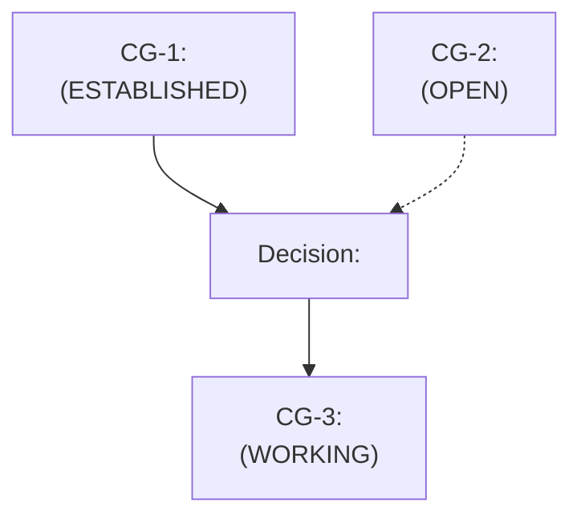

# Common ground

A long project accumulates assumptions nobody wrote down: "the API is idempotent," "users are
always authenticated by this point," "that table is small enough to scan." They start as
guesses, get acted on, and quietly calcify into load-bearing facts that were never actually
checked. This skill keeps a per-project ledger of exactly that gap, in **`docs/common-ground.md`**
of the current repo, so every assumption has a visible confidence tier and a paper trail.

**Target file:** `docs/common-ground.md` relative to repo root (find root via `git rev-parse
--show-toplevel`; if not a git repo, use cwd). Create the file and its `docs/` dir if missing,
using the template below. If the file already exists, read it first and append/update in place;
never overwrite existing entries silently.

**Modes:** when invoking this skill, say which mode you want (or just describe the assumption,
which implies log mode):
- Free text describing one assumption -> **log mode**: record the text as one new assumption.
- No specific assumption named -> **surface mode**: scan the recent conversation/diff for
  unstated assumptions and propose entries.
- "list" / "show the ledger" -> **--list**: print the full ledger grouped by tier.
- "check" / "audit the ledger" -> **--check**: audit ESTABLISHED and WORKING entries against
  current reality; flag any that broke.
- "graph" / "show how assumptions fed into decisions" -> **--graph**: render a mermaid graph of
  how assumptions fed into decisions.

## The three tiers

- **OPEN**: an assumption someone is relying on but nobody has verified. Default tier for
  anything newly logged. Carries a stated risk if wrong.
- **WORKING**: the team is actively building on it (code merged, a decision made) but it is
  still provisional: treat as true for now, revisit if something contradicts it.
- **ESTABLISHED**: confirmed by direct evidence (test, source read, user confirmation, prod
  observation). Only promote here with a cited reason; never promote on repetition alone.

Tier moves only go forward on evidence and backward on contradiction. An assumption that turns
out wrong does not get deleted, it gets marked **BROKEN** with the date and what disproved it, so
the ledger keeps its own history instead of erasing mistakes.

## Mode: default (surface + persist)

1. Read the existing ledger (if any) so you don't duplicate an entry that's already tracked.
2. If a specific assumption was named, treat it as one assumption to log verbatim (tighten the
   wording, keep the meaning).
3. If no specific assumption was named, look at the current diff / recent conversation for claims
   that were *acted on* but never verified: silent preconditions, "should be fine" calls,
   unstated ownership of a decision, a design that only works if some external fact holds.
   Propose each as a candidate, one line each, and ask before writing anything you're not
   confident is real. Do not invent assumptions to fill a quota.
4. For each new entry, append under the `OPEN` section using the entry template below. Assign the
   next sequential ID.
5. Report what was added, in the tier it landed in, and nothing else unless asked.

### Entry template

```
### [CG-<id>] <short assumption statement>
- Tier: OPEN
- Logged: <YYYY-MM-DD>
- Context: <where this came from: file:line, decision, or conversation topic>
- Risk if wrong: <one line, concrete consequence>
- Evidence: <none yet | what would confirm/deny it>
```

## Mode: --list

Read `docs/common-ground.md` and print every entry grouped under three headers, `## OPEN`,
`## WORKING`, `## ESTABLISHED`, each entry as `[CG-<id>] <statement>` plus its Logged date. Add a
trailing `## BROKEN` group only if any exist. Keep it scannable, no editorializing, this is a
readout not a rewrite. If the file doesn't exist yet, say so and stop, don't create it just to
list an empty file.

## Mode: --check

For every entry currently tiered WORKING or ESTABLISHED:
1. Re-derive whether it still holds, using whatever is cheap and concrete: re-read the file/line
   it cites, re-run the check its Evidence line names, or ask if it needs a live look you can't
   do from here.
2. Still holds -> leave it, note "confirmed" inline only if evidence changed.
3. Contradicted -> move it to a `## BROKEN` section: keep the original text, set
   `- Tier: BROKEN (was WORKING|ESTABLISHED)`, add `- Broke: <date>, <what disproved it>`. Do not
   silently delete a broken assumption, the point of this file is the paper trail.
4. Can't determine either way -> leave the tier alone, but add a one-line `- Flagged:
   <date>, needs re-check because <reason>` so it surfaces next time.

End with a short summary: counts confirmed / broken / flagged. If nothing is stale, say that
plainly instead of padding the output.

## Mode: --graph

Render a mermaid flowchart showing how assumptions fed into decisions, most useful once the
ledger has real entries. Read every CG-id and any decisions/commits that reference one (grep the
repo for the `CG-<id>` tag in commit messages, code comments, or `docs/decisions/`). Build:



Conventions: solid arrow = the assumption directly supported the decision; dotted arrow = the
decision merely leaned on an unverified (OPEN) assumption, flagging the exposure. Node label
carries the current tier so the graph doubles as a risk map at a glance. Wrap this in a fenced
mermaid block, don't try to also describe it in prose, the diagram is the deliverable. If fewer
than two entries reference each other, say the graph would be trivial and show the flat list
instead of forcing a diagram.

## Why this matters on a long project

Confidence drifts silently. Something logged as a guess in week one gets treated as bedrock by
week six because everyone built on top of it and nobody re-asked the question. `--list` gives a
fast honesty check before a big decision ("what are we actually still guessing at here").
`--check` catches assumptions that quietly went stale, the number one source of "wait, since
when was that not true" bugs in long-running work. `--graph` shows which decisions are one broken
OPEN assumption away from unraveling, so risk is visible before it becomes a postmortem instead
of after. The ledger's value compounds: cheap the first time, load-bearing by month three.

## Rules

- Never promote a tier without a stated reason; "seems to work" is not evidence.
- Never delete an entry, including broken ones, mark and move, don't erase the record.
- One assumption per entry, don't bundle several unrelated guesses into one CG-id.
- IDs are sequential and permanent, don't renumber on edit.
- Free text with real content always wins over silence, don't invent surfacing candidates on
  a day with genuinely nothing new.

---
Provenance: reimplementation of the assumption-tiering pattern from Jeffallan's
`claude-skills` `common-ground` command/skill, rebuilt from the concept description only
(tiered OPEN/WORKING/ESTABLISHED assumption ledger persisted per-project), not from reading or
copying that source. Structure, wording, modes, and templates here are original.
